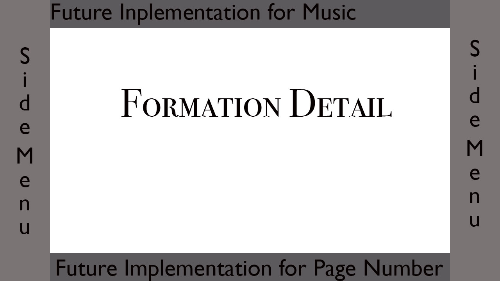

# FormationHelper
This app aims at helping dancers to read and share dance formations.

## Background
Something something

## Features
Something will be put here when I actually have stuff

## Developmental work
We are currently working on the teacher side of the app. According to the survey we handed out, most teachers use laptop. Under this consideration, we decided to first build a web app.
### Using React
Some references
React vs Vue: https://www.monterail.com/blog/vue-vs-react-2019

React vs Angular: https://programmingwithmosh.com/react/react-vs-angular/

React tutorial: https://reactjs.org/docs/getting-started.html

### Weekly documentation
Week 0(Jun 23): Framework/Library decided. Building foundations

Week 1(Jun 30): Studied for basic React stuff. Worked on the detailed plan.

## Ideas and Meeting notes
28号meeting主要内容
1. 先给大家介绍一下具体的app，不知道大家那两个视频都看了没有
    1. market research cyh
        1. 一段音乐的快慢
        2. 体操、健美操用的 8个formation 用siri来控制 投在大屏幕上 缺点是不能加音乐 也不知道每一个人 只有一个个formation的名字 没有点 不知道具体谁站在那里 适合排过队形复习的
        3. Playbook 平面图 加点上去 还可以署名 可以拖动 但是不能通过Siri控制 只能手一个个点 但是没有音乐 不知道哪里换队形 不是三维的 不知道什么时候蹲下
        4. Pinterest上舞蹈博主会collect formation
        5. 首先必须要有点；做成三维；最好能加上音乐；最好能署名
2. 具体的平台用的会是React 抽查一下有没有人知道react 介绍一下具体的差别
3. 发表一下任务 主要的任务：在GitHub跟大家分享了之后 自己拉一个branch 然后在新的branch里
    1. 可以打开最初始的内容
    2. 进行一些稍微的改动之后commit到自己的branch里面
    3. 里面readme写的内容几乎都过期了所以不需要看也可以
4. 这些任务希望在下周之前可以完成 越快越好 如果进行的改动越特别越好

7.5 meeting
Current Idea:
Stage One - Non Moving Formations
1. Welcome Interface
    1. Currently only adding the buttons, they don’t need to lead to anywhere (but we need the Create New button to lead to the Main Page for easier future testings)
    2. Main buttons
        1. Create New
        2. Load Local
        3. Download Online
        4. Credits
    3. It’s important to recognize that in the future there should be a leading page for the user to input the number of dancers and names/colors of these dancer dots.
2. Main Page(See Example)

    1. Side Menu (left): activate by hovering to the very left or by clicking the top left button, which disappears when the menu is activated, but reappears when the menu is no longer available; this menu is mainly in charge of main actions
        1. Show/Hide Music(Content changes with the condition of Top popup)
        2. Show/Hide Pages(Content changes with the condition of Bottom popup)
        3. Change Dance Name
        4. Change Dancer Number
    2. Side Menu (right): activate by hovering to the very right or by clicking the top right button, which disappears when the menu is activated, but reappears when the menu is no longer available.; this menu is mainly in charge of actions related to the particular formation for this page
        1. Default formations
        2. Copy previous formation
        3. Change dots information (You can change the name/color of all the dots - dots all have a number to them)
        4. Settings
            1. Reverse front stage/backstage order
            2. Change stage size
    3. Top popup (Appears after the Show Music button is clicked)
    4. Bottom popup (Appears by default; showing the current page and total pages)
        1. You can change the page you are looking at
        2. There’s a + button at the end of all pages that you can click to create a new formation
        3. Click and drag on a certain page can move its position
    5. Main Page adjustment to current formation
        1. It should have front stage backstage listed; which can be changed by settings
        2. There should be an onstage offstage area (Dots/Dancers that are not onstage should not be deleted, instead they are either in the onstage area or offstage area)
        3. Click and drag on a current dot in order to change its position
        4. Double click on a dot to change its name and/or color
3. Credits Page
    1. A single page that lists all the contributors’ names, any references if we have in the future, and GitHub repository’s link

Current Task for 7.12.
1. (Yuhan Chen) Welcome Interface and 4 buttons
    1. If this task is done, work on the page that follows Create New, where users are asked to input dance name; dancers number
2. Main Page two side menus (buttons not required; but the ability of being activated by hovering & the side button is required as well as the deactivation of these menus)
    1. If this task is done, work on the buttons listed above
    2. If 2.1 is done, work on activation of top and bottom popup; important to know that the top and bottom popup should be behind the left and right side menus when coexists.
3. Main Page onstage/offstage; Front stage/Backstage exhibition
    1. If this task is done, work on the link between Credits to the Credits Page
4. (Yuxiang Chen) Create New first Page (the page after Create New button is clicked and happens before Main Page to gather information)
    1. number of dancers
    2. the name of dance
    3. *load music

7.12 Meeting

1. Discuss on some slight adjustment

To do list:
1. Router - page Shift
2. Slight Css changes
    1. Welcome page doesn't AppHeader
    2. Other pages can have an AppHeader - but only with a Title and a going back button (going back to the WelcomePage)
    3. Button sizes and canvas default size should be stable in MainPage
3. Formation Canvas development - the construction (Write UML for the model)
4. Knowing how to load music

Meeting for 7.19
Tasks:
1. Main Page styles changes
    1. Two buttons 一左一右 (rock)
    2. Buttons 不应该占一条 而应该浮在页面上面 (rock)
    3. 页面中间的几个Label应该有固定大小 Stage和off Stage方块的区域，很大一块地方+中间会有字体标注，Front和Back可以是一条，不是一块区域 (cyh)
    4. Drawer打开是黑色的好丑哦 (cyx)
2. Formation Dots
    1. 在Stage和Off Stage的区域里有浅灰色的grid可以把dot放在上面(cyh)
    2. 有Dot的class 里面存储一些dot的information - position，dancer name，color (yxy)
    3. 在Welcome Page点进Create New的时候，应该有popup 需要录入一些基本资料，比如说Dance Name，Dancer Number， Load Music (yxy)
3. Main Page 两个Button的功能
    1. Load Music (cyx)
    2. Change Dance Name/Dancer Number
    3. Change dots information

Meeting for 8.2
Tasks:
1. 数据流动(yxy)
    1. popup里面的数据可以留存下来到main page
    2. backend用Spring Boot
2. Main Page Style Changes (cyh)
    1. Two buttons 一左一右且不占一整条空间
    2. 打开的Drawer的长度是一整个屏幕+每个按键的长度再长一点
    3. Stage和OffStage的字在整块区域的最中间
3. Load Music具体实现 (cyx)
    1. 可以载入真的music
    2. music的显示在屏幕的上面(跟左边按钮中的show/hide music相连接)
    3. music文件的显示是一系列的音波
4. Dot可以拖动(pyr)
5. 屏幕下方存在页数的显示(现在可以只是一个显示，不需要跟别的数据相关联)(yxy)
6. SideBar里面的按钮的功能分开（每个按钮可以导向不同的功能) (pyr)

Meeting for 8.9
Notes:
1. 引入了backend - SpringBoot; REST API
Tasks:
0. (全部)学习SpringBoot相关知识,可能1~2周内开始进行SpringBoot相关内容
+++++++++++++++++++++++++++++++++++++++++++++++++++++++++++++++++++++++++++++++++++++++++++++++
1. Main Page两个按钮打开的Drawer长度占满整个屏幕，并在层次上处于Header下方(CYX)
2. Main Page按钮的连接
    1. 点Hide/Show Music可以打开或隐藏页面上方的音乐条(CYX)
    2. 点Hide/Show Pages可以打开或隐藏页面下方的页数缩略图条(PYR)
    3. 点Change Dance Name，弹出Popover，可改变舞蹈名称（作为标题显示在Header(YXY)
    4. 点Change Dancer Number，弹出Popover，可改变舞蹈人数，会直接反应在Dot的数量上(YXY)
3. Dancer Number输入后创建相应数量的Dot - 默认现在都是黑色且旁边无备注等等（只是单纯的点 (CYH)
4. 可以拖动Dot (PYR)
5. 自由缩放屏幕大小时，舞台设计不会出现排版问题
    1. 设定一个最小的限制，达到那个限制前等比例缩放，到达那个限制后出现进度条可以移动，但舞台大小不会在继续缩小（不然如果屏幕设定太小的话，缩放到了最后所有的Box会叠在一起，就看不到任何的Dot了）（CYX
6. Main Page中，Stage和OffStage应该作为背景提示字，也就是说Dot可以移动在这个字的上面，在层次上来说Dot是在这些字更往上的层，互相之间没有干扰 (CYH)
7. 屏幕下方会有页数的显示，就跟PDF看书一样，会有每一小页的缩略图，目前只有第一页（还不需要缩略图具体反映当前图的内容 (PYR)
8. Load Music的具体实现，Welcome Page的Popover出现一个新的内容条是Load Music，然后可以把音乐Load到Main Page里面 (CYX)
9. Load的Music以音波形式表现在屏幕上方 (CYX)
10. 屏幕上方的Music文件的音波可以标注具体的地方（这页的音乐从哪里开始，从哪里结束 （CYX
11. Refractory side bar的写法 - 让所有的问题都可以分开来写function (YXY
12. 灰色格子背景 作为点的参照坐标系（但是现在不强行要求点在坐标上 （CYH 

Meeting for 8.16
Tasks
1. 音乐部分(CYX)
    1. 音乐部分有光标显示现在播放到哪里（现在还不需要可以拖动它
    2. 音乐部分可以点击音波增加分割线，（相当于Pr里面的Marker的功能
    3. 音乐部分仅显示Import的音乐的名称 不需要演唱者姓名，但是需要在Upload之后改成那个名称
2. 分页部分(YXY)
    1. 点Hide/Show Pages可以打开或者隐藏页面下方的页数缩略图条
    2. 屏幕下方会有页数的显示，就跟PDF看书一样，会有每一小页的缩略图(!)，目前只有第一页（还不需要缩略图具体反映当前图的内容
    3. 页数缩略图条可以增加页数
3. Canvas部分(CYH)
    1. Dot不应该跑到Canvas以外的地方（现在还是可以跑出去，打开音乐的话
    2. 背景应该有灰色格子 但是灰色格子不会影响Dot的位置 只是作为参考
    3. Dot之间不可以Overlap
    4. Dot现在到不了offstage的地方
4. Dot部分(PYR)
    1. 点击右侧按钮的Change Dots Information 右侧的工具栏会变成Dots的Information List
    2. Dots的信息包括 号码 颜色 名字 （位置信息存储在Dot class里 不用展示出来
    3. Dots旁边会有一个小号码 在InformationList的最下方可以有一个可以勾选的展示号码的选项
    4. 改变舞蹈人数之后不能马上反映在Dot的数量上

Meeting for 9.8

Tasks
++++++++++++++++++++++++++前端部分++++++++++++++++++++++++++
1. 分页部分
    1. 点Hide/Show Pages可以打开或者隐藏页面下方的页数缩略图条
    2. 屏幕下方会有页数的显示，就跟PDF看书一样，会有每一小页的缩略图(!)，目前只有第一页（还不需要缩略图具体反映当前图的内容
    3. 页数缩略图条可以增加页数
    4. 和后端的沟通
2. Canvas部分
    1. Dot不应该跑到Canvas以外的地方 但应该可以跑到offstage的地方
    2. 背景应该有灰色格子 但是灰色格子不会影响Dot的位置 只是作为参考
    3. Dot之间不可以Overlap
3. Dot部分
    1. 点击右侧按钮的Change Dots Information 右侧的工具栏会变成Dots的Information List
    2. Dots的信息包括 号码 颜色 名字 （位置信息存储在Dot class里 不用展示出来
    3. Dots旁边会有一个小号码 在InformationList的最下方可以有一个可以勾选的展示号码的选项
    4. 改变舞蹈人数之后不能马上反映在Dot的数量上

++++++++++++++++++++++++++后端部分++++++++++++++++++++++++++
1. 存储每页的队形
2. 存储音乐（有必要嘛
3. 存储整个队形文件的方法

++++++++++++++++++++++++++debug部分++++++++++++++++++++++++++
1. 直接从main这个端口进入的话，会报错，要想办法保留基础信息